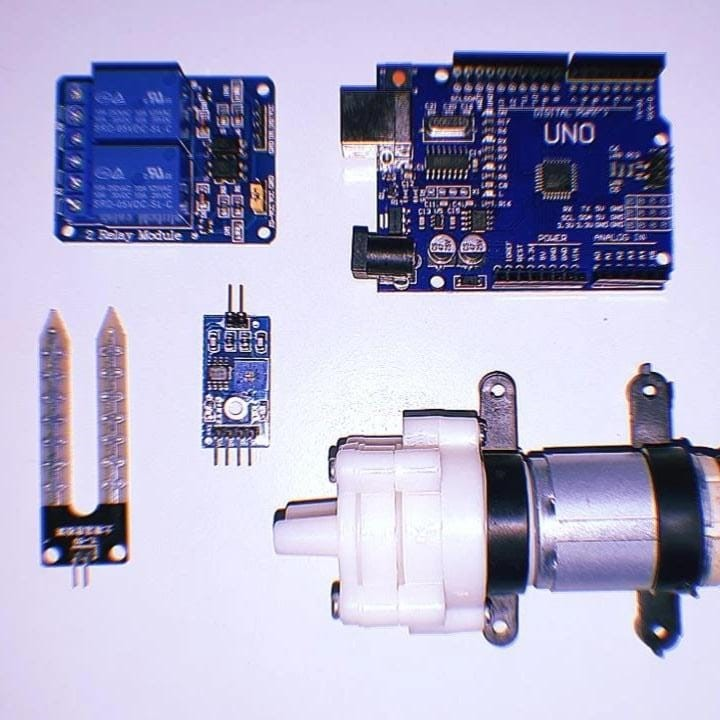

# JJ

Projeto J&amp;J de Microcontroladores e IOT do 4º semestre do Bacharel de Ciências da Computação no Centro Universitário FMU

# Badges

 
  
  
  
  
  
  

# Índice 

* [Nome da Equipe](#jj)
* [Badges](#badges)
* [Índice](#índice)
* [Nome do Projeto](#nome-do-projeto)
* [Descrição do Projeto](#descrição-do-projeto)
* [Integrantes do Projeto](#integrantes)
* [Status do Projeto](#status-do-projeto)
* [Apresentação do Projeto](#apresentação-do-projeto)
* [Link do Vídeo](#link-do-vídeo)
* [Conclusão](#conclusão)

# Nome-do-projeto

Sistema de Irrigação automática

# Descrição-do-projeto

O Sistema Automatizado de Irrigação para Plantas Pequenas é um projeto desenvolvido para simplificar e aprimorar o processo de irrigação. Utilizando a tecnologia do Arduino Uno R3, este sistema inteligente elimina a necessidade de irrigação manual, garantindo que suas plantas recebam a quantidade certa de água, no momento ideal, sem qualquer intervenção humana.

<h3> <strong> Características </strong> </h3>

Irrigação Automatizada: O coração do sistema é o Arduino Uno R3, que controla precisamente a irrigação com base em sensores de umidade do solo. Quando o solo atinge um nível de secura pré-definido, o sistema é ativado automaticamente, liberando a quantidade adequada de água para as plantas.

Eficiência Energética: O projeto é altamente eficiente em termos de consumo de energia, garantindo um funcionamento contínuo sem aumentar significativamente os custos de eletricidade.

Simplicidade de Uso: Sua interface intuitiva torna a configuração e monitoramento do sistema extremamente fácil. Qualquer pessoa, independentemente do seu nível de experiência em jardinagem ou eletrônica, pode usar o sistema sem dificuldade.

Economia de Recursos: Ao fornecer a quantidade certa de água no momento certo, o sistema reduz o desperdício de água, contribuindo para a conservação dos recursos naturais.

# Integrantes

Turma: 191104A16
| [ Alice Nayumi Harada  RA:1800150](https://github.com/Nayu-mi) |  [ Beatriz Batista Jorge RA:1754415](https://github.com/BeatrizBJorge) |  [ Henry Gabriel Araujo Oliveira RA: 1432500](https://github.com/Henrygbriel) |
| :---: | :---: | :---: |
| Membro | Líder | Membro |
| alice.nayumi@outlook.com | bia.barbie654@gmail.com | henrygbrieloliveira@gmail.com |

# Status-do-projeto

<h4 align="center"> 
    🏁:  Projeto Concluído 🏁:
    
</h4>

# Apresentação-do-projeto
componentes: físico 📸    

   
Código: 💻    

 
# Link-do-vídeo

➡️ https://youtu.be/6ePyugiG2lc
  OBS: 🤡

# Conclusão
O sistema de irrigação automático tem como resultado uma agricultura sustentável e à automação residencial inteligente. Já que, elimina a necessidade de irrigação manual, assim o sistema não só economiza tempo e esforço, mas também promove a saúde das plantas ao fornecer a quantidade certa de água no momento adequado.
O projeto não apenas demonstra a integração de tecnologias como sensores e microcontroladores, mas também oferece espaço para melhorias futuras. A implementação de sensores adicionais, conectividade IoT, aprendizado de máquina e fontes de energia renovável poderia elevar este sistema a novos patamares de eficiência e sustentabilidade.
Além disso, incorporar conceitos de conservação de água, energia e automação, faz com que este projeto sirva como um exemplo prático de como a tecnologia pode ser aplicada para criar soluções inovadoras e ecoconscientes.

# Roteiro do vídeo

🌵 Apresentação
* Individual
* Quem é você?
* Da onde você é?
* O que você faz no projeto?

🛠️ Projeto
* Sobre (imagens png e código fonte)
* Individual o que cada um fez
* Mostrar os componentes (físico e código fonte)
* Resultado (conclusão)
* Melhoras (trabalhos futuros)

😺 Repositório GitHub
* READ.ME: apresentação do projeto, escrita, fotos e links
* Pastas: uma para o código e uma para imagens
* Código de fonte

<code>The end...   
For now 🙀 </code>
